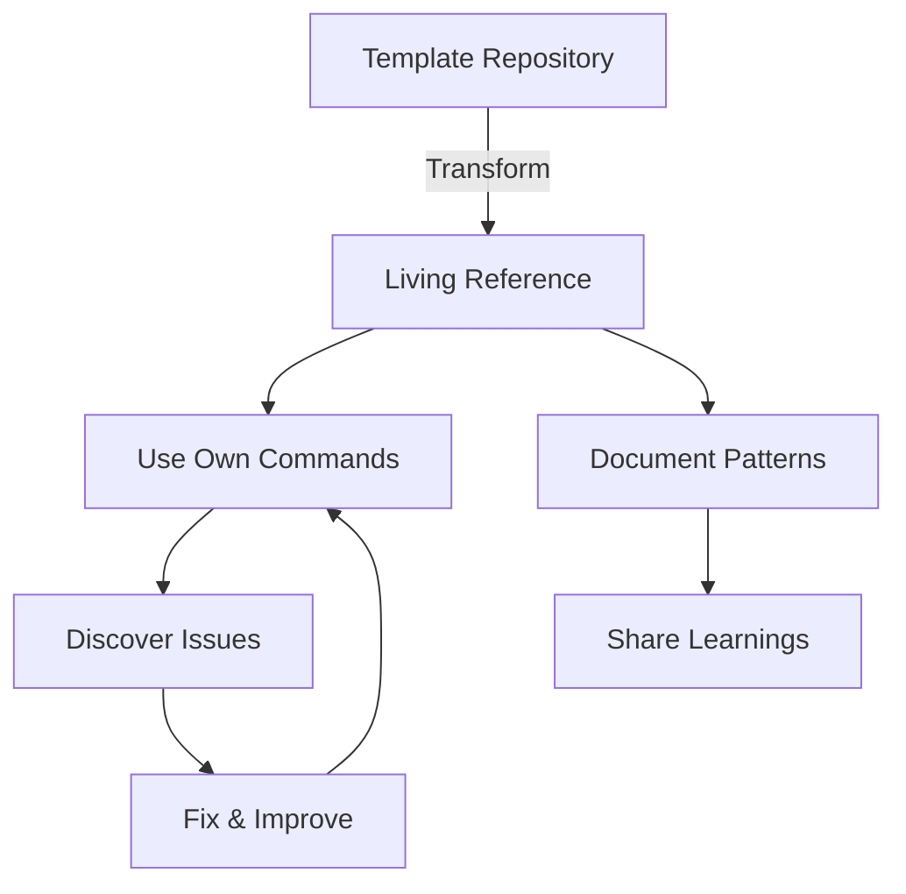
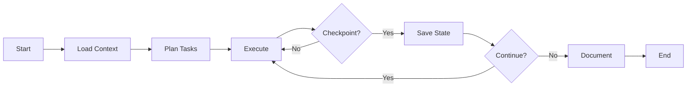
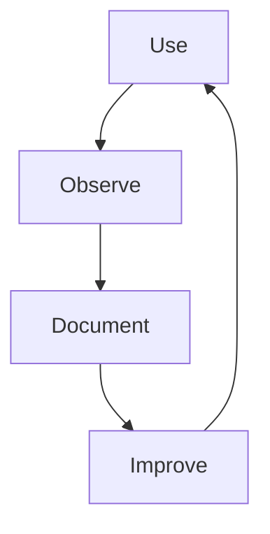

# Claude Code Patterns

<!--
This document is self-updating. To regenerate:
In Claude Code: /docs update claude-patterns
Last updated: 2025-01-16
-->

Discovered patterns and strategies specific to Claude Code development sessions.

## Table of Contents

- [Token Efficiency Patterns](#token-efficiency-patterns)
- [Context Management](#context-management)
- [Command Architecture](#command-architecture)
- [Living Reference Pattern](#living-reference-pattern)
- [Self-Documentation System](#self-documentation-system)
- [Session Management](#session-management)
- [Anti-patterns to Avoid](#anti-patterns-to-avoid)

---

## Token Efficiency Patterns

### NPM Script Delegation

**Pattern**: Move command logic to npm scripts, keep Claude commands minimal

#### Before (264 lines, ~3000 tokens)

```markdown
# .claude/commands/hygiene.md

<bash>
# Check for TypeScript errors
npx tsc --noEmit

# Run ESLint

npx eslint . --fix

# Check for security vulnerabilities

npm audit

# ... 250+ more lines of logic

</bash>
```

#### After (30 lines, ~300 tokens)

```markdown
# .claude/commands/hygiene.md

<bash>
npm run hygiene:full --silent
</bash>
```

#### Implementation in package.json

```json
{
  "scripts": {
    "hygiene:full": "npm run typecheck && npm run lint:fix && npm audit",
    "typecheck": "tsc --noEmit",
    "lint:fix": "eslint . --fix"
  }
}
```

**Result**: 87-91% token reduction across all commands

### Token Budget Strategy

| Task Type           | Token Budget | Message Count |
| ------------------- | ------------ | ------------- |
| Bug Fix             | 5K-10K       | 10-30         |
| Small Feature       | 10K-30K      | 30-80         |
| Major Feature       | 30K-100K     | 100-300       |
| Architecture Change | 100K-200K    | 200-500       |

### Batching File Operations

**Anti-pattern**: Reading files one at a time

```markdown
Read file1.js
Read file2.js
Read file3.js
```

**Pattern**: Batch related reads

```markdown
Read file1.js, file2.js, file3.js in parallel
```

---

## Context Management

### Checkpoint System

**Pattern**: Regular context checkpoints prevent overload

#### Checkpoint Triggers

1. **Time-based**: Every 30 minutes
2. **Interaction-based**: Every 20-30 messages
3. **Complexity-based**: After major architecture decisions
4. **Error-based**: After recovering from significant errors

#### Checkpoint Actions

```bash
# Save current state
git stash
git checkout -b checkpoint-$(date +%s)
git stash pop
git add -A
git commit -m "checkpoint: $(date)"

# Document decisions
# Create checkpoint as GitHub issue comment
gh issue comment 1 --body "## Checkpoint $(date)
- Completed: X, Y, Z
- Next: A, B, C"

# Compact if needed
if [ $INTERACTION_COUNT -gt 30 ]; then
  echo "Consider compacting context"
fi
```

### Context Preservation

**Pattern**: Save critical information before compaction

```markdown
# Before compacting, always save:

1. Session transcript
2. Git history
3. Key decisions
4. Learned patterns
5. Next actions
```

### Context Window Optimization

```javascript
// Priority levels for context
const CONTEXT_PRIORITY = {
  CRITICAL: ['Current task requirements', 'Recent errors and fixes', 'Active file contents'],
  HIGH: ['Related file contents', 'Recent git commits', 'Project structure'],
  MEDIUM: ['Documentation', 'Test results', 'Dependencies'],
  LOW: ['Historical commits', 'Archived decisions', 'Old conversations'],
};
```

---

## Command Architecture

### Subdirectory Organization Pattern

**Pattern**: Organize command variants using subdirectories

```
.claude/commands/
├── hygiene.md              # Minimal, token-efficient (default)
├── commit.md               # Minimal version
├── todo.md                 # Minimal version
└── detailed/
    ├── hygiene.md          # Verbose, comprehensive (fallback)
    ├── commit.md           # Detailed version
    └── todo.md             # Detailed version
```

### Command Naming Conventions

| Type       | Pattern     | Example                        |
| ---------- | ----------- | ------------------------------ |
| Action     | verb        | `commit`, `test`, `deploy`     |
| Query      | noun        | `status`, `metrics`, `report`  |
| Management | verb-noun   | `update-docs`, `check-quality` |
| Meta       | meta-action | `token-check`, `session-save`  |

### Command Discovery

```bash
# Users can discover available commands
ls .claude/commands/*.md | sed 's/.*\///' | sed 's/\.md//'

# Users can check for detailed versions
ls .claude/commands/detailed/*.md 2>/dev/null
```

---

## Living Reference Pattern

### Principles

1. **Dogfooding**: Repository uses its own commands
2. **Proof by Example**: Every pattern is demonstrated
3. **Evolution Through Use**: Commands improve through actual usage
4. **Reality Over Theory**: Practical implementation over theoretical design

### Implementation Strategy



### Success Metrics

- Commands used: 100% coverage
- Self-updates performed: Daily
- Pattern validations: Every commit
- Documentation accuracy: Auto-verified

---

## Self-Documentation System

### Auto-Generation Pattern

**Pattern**: Commands generate their own documentation

```bash
# Command updates its own docs
npm run docs:generate -- --command=hygiene

# Verify documentation
npm run docs:validate -- --command=hygiene

# Update all documentation
npm run docs:update -- --all
```

### Documentation Hierarchy

```
docs/
├── COMMAND_CATALOG.md      # Auto-generated from commands
├── BEST_PRACTICES.md       # Curated with citations
├── CLAUDE_PATTERNS.md      # This file - discovered patterns
├── TOKEN_EFFICIENCY.md     # Metrics and strategies
└── SELF_UPDATING.md        # How docs update themselves
```

### Citation Management

```markdown
<!-- Pattern for citations -->

[Statement needing citation]^[1]

<!-- References -->

[1]: https://source.url 'Source Title'
```

### Validation System

```javascript
// Validate all citations are valid
async function validateCitations(file) {
  const citations = extractCitations(file);
  for (const citation of citations) {
    const isValid = await checkUrl(citation.url);
    if (!isValid) {
      console.error(`Invalid citation: ${citation.url}`);
    }
  }
}
```

---

## Session Management

### Session Lifecycle



### Session Patterns

#### 1. Planning Phase

```markdown
1. Read CLAUDE.md for project context
2. Check GitHub issues for current state
3. Review recent git history
4. Create todo list
5. Estimate token usage
```

#### 2. Execution Phase

```markdown
1. Mark todo as in_progress
2. Execute task
3. Test immediately
4. Mark as completed
5. Update metrics
```

#### 3. Reflection Phase

```markdown
1. Document learnings
2. Update patterns
3. Save session transcript
4. Plan next session
```

### Recovery Patterns

**Pattern**: Graceful recovery from errors

```bash
# Save state before risky operations
git stash save "Before risky operation"

# Attempt operation
if ! npm run risky:operation; then
  # Recover
  git stash pop
  echo "Operation failed, state restored"

  # Document failure
  echo "## Failed: risky:operation" >> LEARNINGS.md
  echo "Reason: $ERROR" >> LEARNINGS.md
fi
```

---

## Anti-patterns to Avoid

### 1. Context Tunnel Vision

**Anti-pattern**: Losing sight of broader context

```markdown
BAD: Deep diving into implementation without checking requirements
GOOD: Regularly refer back to original task and goals
```

### 2. Assumption Cascade

**Anti-pattern**: Building on unverified assumptions

```markdown
BAD: Assuming file exists -> Making changes -> Discovering it doesn't
GOOD: Verify first -> Plan -> Execute
```

### 3. Commit Sprawl

**Anti-pattern**: Large, unfocused commits

```markdown
BAD: 1000+ line commits mixing features
GOOD: <200 line atomic commits with single purpose
```

### 4. Documentation Debt

**Anti-pattern**: Postponing documentation

```markdown
BAD: "I'll document this later"
GOOD: Document as you go, update in real-time
```

### 5. Test Skipping

**Anti-pattern**: Moving to next task without testing

```markdown
BAD: Implement feature -> Move to next
GOOD: Implement -> Test -> Fix -> Move
```

---

## Pattern Evolution

### Discovery Process

1. **Observe**: Notice recurring situations
2. **Document**: Capture in LEARNINGS.md
3. **Abstract**: Extract general pattern
4. **Validate**: Test across multiple uses
5. **Codify**: Add to this document

### Pattern Maturity Levels

| Level             | Description       | Action                    |
| ----------------- | ----------------- | ------------------------- |
| 0 - Observation   | Noticed once      | Document in LEARNINGS     |
| 1 - Hypothesis    | Seen 2-3 times    | Track occurrences         |
| 2 - Pattern       | Proven useful     | Add to patterns           |
| 3 - Best Practice | Widely applicable | Promote to BEST_PRACTICES |
| 4 - Standard      | Essential pattern | Enforce via tooling       |

---

## Session Preservation Pattern

### Overview

Session preservation captures raw conversation transcripts for future reference. This is an optional feature that some users find valuable for learning and analysis.

### Implementation

```bash
# Save current session
npm run session:save

# Save with description
npm run session:save -- "feature-implementation"

# Save delta only (changes since last save)
npm run session:delta

# List saved sessions
npm run session:list
```

### Directory Structure

```
session-history/
├── YYYY-MM-DD/
│   ├── session-NNN-HHMM.txt         # Full session
│   ├── session-NNN-HHMM.meta.json   # Metadata (Claude version, etc.)
│   └── session-NNN-HHMM-delta.txt   # Delta save
└── .last-save                       # Tracks last save for deltas
```

### Metadata Tracking

Each session automatically captures:

- Claude Code version
- Timestamp
- Session type (full/delta)
- Environment context

### Use Cases

- **Learning Analysis**: Review problem-solving approaches
- **Pattern Discovery**: Identify recurring solutions
- **Knowledge Base**: Build personal reference library
- **Team Sharing**: Share successful debugging sessions

### Living Reference Practice

This repository demonstrates session preservation by saving its own development sessions. These provide real examples of the feature in use.

---

## Meta-Patterns

### The Pattern of Patterns

- Patterns emerge from repetition
- Documentation crystallizes patterns
- Automation codifies patterns
- Evolution refines patterns

### Continuous Improvement



---

_Last updated: 2025-01-16_
_Pattern count: 16 major patterns documented_
_Next review: After next significant session_
